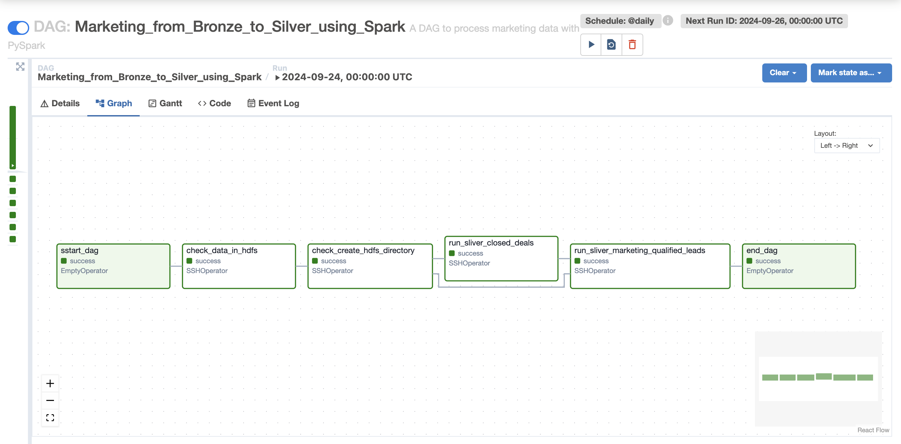

# BIG DATA PROJECT: Ecomerce Insights Lakehouse Project
<span style="color:red">**WARNING:** This project only runs on ARM64 chips.</span>

# Project Objective
The goal of **Ecomerce Insights Lakehouse Project** is to design and build an end-to-end E-Commerce Data Lakehouse that integrates various data sources from PostgreSQL databases (Ecom and Marketing) and log-based data (ecommerce_clickstream_transactions and access_log_ecommerce). This architecture combines batch and real-time data processing to provide insights for data analytics, data science, and business intelligence using tools like Power BI and Jupyter Notebook. The system also monitors the data pipelines and streaming jobs using Grafana, Kibana, and other monitoring tools.

# Datasets Selection

## 1. Brazilian E-Commerce Public Dataset by Olist and Marketing Funnel by Olist

### 1.1. Brazilian E-Commerce Public Dataset by Olist
- Source: [Brazilian E-Commerce Public Dataset by Olist](https://www.kaggle.com/datasets/olistbr/brazilian-ecommerce)

This dataset was generously provided by Olist, the largest warehouse in the Brazilian markets. Olist connects small businesses across Brazil to channels seamlessly and with a single contract. These merchants can sell their products through Olist Store and ship them directly to customers using Olist's logistics partners.

### 1.2. Marketing Funnel by Olist
- Source: [Marketing Funnel by Olist](https://www.kaggle.com/datasets/olistbr/marketing-funnel-olist)

This is a marketing funnel dataset from sellers that filled-in requests of contact to sell their products on Olist Store. The dataset has information of 8k Marketing Qualified Leads (MQLs) that requested contact between Jun. 1st 2017 and Jun 1st 2018. They were randomly sampled from the total of MQLs.

### 1.3 Join two Dataset and import to PostgresDB

Both the Brazilian E-Commerce Public Dataset and the Marketing Funnel by Olist were imported into a PostgreSQL database to form the foundation of the project's data warehouse. The resulting schema integrates customer transactions with lead generation efforts, providing a holistic view of e-commerce operations and marketing strategies.

  <center>
      
  </center>

## 2. Ecommerce Clickstream Transactions
- Source: [Ecommerce Clickstream Transactions](https://www.kaggle.com/datasets/ren294/ecommerce-clickstream-transactions)
  
This dataset provides simulated data for user interactions on an e-commerce platform. It includes sequences of events such as page views, clicks, product views, and purchases. Each record captures user activity within sessions, making it suitable for analyzing clickstream paths and transaction sequences.

## 3. Access Log E-Commerce
- Source: [Access Log E-Commerce](https://www.kaggle.com/datasets/ren294/access-log-ecommerce)
  
The Access Log E-Commerce dataset simulates server logs that detail user interactions with the e-commerce platform at the backend. Each log entry provides metadata such as timestamp, IP address, request type, status codes, and other parameters commonly found in server access logs.

# System Architecture

The Data Lakehouse architecture implemented in this project is designed to handle both batch and real-time streaming data, integrating multiple data sources into a cohesive analytics platform. 

The system is divided into several components, each responsible for specific tasks within the data process:

  <center>
      
  </center>

## Data Sources
The architecture brings together structured and unstructured data from several key sources:

### 1. PostgreSQL Databases:

- **Ecom Database**: Contains structured data related to customer information, orders, product details, reviews, sellers, and transactions. This database reflects the transactional core of the e-commerce platform.

- **Marketing Database**: Contains marketing-related data, particularly focused on Marketing Qualified Leads (MQLs), helping to track the effectiveness of marketing efforts and the progression of leads through the funnel.

### 2. Log-Based Data:

- **Ecommerce Clickstream Transactions**: This dataset captures user interactions with the e-commerce platform, such as clicks, views, and purchases. It reflects customer behavior in real-time, making it essential for analyzing user engagement and optimizing the shopping experience.

- **Access Log E-Commerce**: Server logs that provide metadata about user activity, requests, and system performance. This log-based data is critical for tracking the health and uptime of the platform.

## Data Processing Layers
The system processes data in distinct layers, each serving a different purpose in the overall workflow.

### 1. Batch Layer

- **Ingestion**: Structured data from PostgreSQL databases (Ecom and Marketing) is ingested into the Bronze layer of the Data Lakehouse using Sqoop, scheduled through Apache Airflow for regular updates. This ensures that fresh data is continuously available for processing.

- **Transformation**: Once ingested into the Bronze layer, the data is processed by Apache Spark to clean, enrich, and transform it into more structured formats. This refined data is then stored in the Silver layer of the Data Lakehouse.

- **Storage**: The transformed data is stored in HDFS in the Silver layer, with subsequent writes to the Gold layer for highly structured, query-optimized data in Hive using the Parquet format. This is the final stage of batch processing and provides a robust foundation for analytics.

### 2. Streaming Layer
- **Real-Time Ingestion**: Streaming data from ecommerce_clickstream_transactions and access_log_ecommerce is ingested into the system using Apache NiFi and published to Kafka topics.

- **Real-Time Processing**: Apache Spark Streaming consumes the Kafka topics and processes the data in near real-time, cleaning and enriching it before publishing it to new Kafka topics. These processed streams are then ingested by NiFi and stored in Cassandra for quick retrieval and further analysis.

- **Monitoring**: Processed real-time data is stored in Cassandra and HDFS Silver for quick retrieval and analysis. Logs from Spark Streaming jobs are monitored using Filebeat and Logstash, with logs being sent to Elasticsearch for detailed log analysis and visualizations through Kibana. Redpanda’s built-in monitoring tools help track Kafka topic health, consumer lag, message throughput, and latency, ensuring that the streaming layer remains performant and reliable.

## Storage Layer
The storage layer follows a Bronze-Silver-Gold tiered model, where data transitions from raw to refined as it moves through the pipeline:

- **Bronze Layer**: Raw, unprocessed data from various sources, such as PostgreSQL and log files, is stored in HDFS. This is the initial ingestion layer, where data is kept in its original form.

- **Silver Layer**: Processed and cleaned data, suitable for analytics and machine learning, is stored in HDFS. This layer serves as a refined dataset for further querying and model building.

- **Gold Layer**: Highly optimized and structured data stored in Hive in the Parquet format. This layer is query-ready and used for reporting and BI tools such as Power BI.

## Analytics and Reporting

- **Data Science**: Spark MLlib is used in conjunction with Jupyter Notebook for advanced analytics and machine learning. Data scientists can access data from the Silver layer to build predictive models, analyze customer behavior, and generate insights into product recommendations, churn predictions, and more.

- **Business Intelligence**: Power BI is employed to visualize data from the Gold layer. Business users can create dynamic dashboards and reports, providing insights into sales performance, customer segmentation, marketing effectiveness, and operational metrics.

## Monitoring and Logging
A comprehensive monitoring and logging system is integrated into the architecture to ensure the smooth operation of data pipelines and processing jobs.

- **Grafana**: Monitors system metrics such as CPU, memory, and disk usage of the Docker containers hosting various components.
  
- **Elastic Stack (Filebeat, Logstash, Kibana)**: Logs from Spark jobs are collected using Filebeat, passed through Logstash for processing, and indexed into Elasticsearch. Kibana is used to visualize these logs, providing insights into job performance, system errors, and resource utilization.
  
- **Docker**: The entire architecture is containerized using Docker for easy deployment and scaling. Monitoring of the Docker containers is managed, which tracks CPU, memory, and resource usage for each container.
  
- **Apache Airflow UI** is used for scheduling and monitoring batch jobs. The Airflow UI allows visualization of DAGs (Directed Acyclic Graphs), tracking job statuses, scheduling intervals, and monitoring task failures or successes.

# Technologies Used
The Data Lakehouse architecture implemented in this project leverages a range of modern technologies to efficiently manage, process, and analyze data from various sources. The following sections provide a detailed overview of the technologies used in each aspect of the system, including data ingestion, processing, storage, analytics, and monitoring.

  ## Data Ingestion and Integration
  
- **Apache NiFi**: NiFi supports real-time data streaming, flexible routing, data transformation, and error handling.
  
- **Apache Sqoop**: Sqoop enables scheduled imports and exports, integration with Hadoop ecosystems, and efficient bulk data transfer.
  
- **Apache Kafka**: Kafka provides scalability, fault tolerance, and high-throughput message processing for real-time data ingestion.
  
- **Redpanda**: Redpanda provides real-time insights into Kafka pipelines, reducing operational overhead while ensuring high availability and fault tolerance.

## Data Processing

- **Apache Spark**: Spark Streaming provides scalable, high-throughput, fault-tolerant stream processing, making it suitable for real-time analytics and event-driven applications.
  
- **Apache Spark Streaming**: Spark Streaming provides scalable, high-throughput, fault-tolerant stream processing, making it suitable for real-time analytics and event-driven applications.
  
- **Spark MLlib**: MLlib integrates seamlessly with Spark, allowing data scientists to work with large datasets and build scalable machine learning models within the same ecosystem.

## Data Storage

- **Hadoop Distributed File System (HDFS)**: HDFS offers distributed storage, fault tolerance, and scalability for managing large volumes of data.
  
- **Apache Hive**: Hive provides data warehousing capabilities, schema-on-read, and efficient querying through the use of optimized storage formats like Parquet.
  
- **Apache Cassandra**: Cassandra offers high throughput for real-time data storage, horizontal scalability, and fault tolerance.

## Data Analytics and Visualization

- **Power BI**: Power BI offers interactive dashboards, real-time data visualization, and easy integration with Hive and other databases for querying large datasets.
  
- **Jupyter Notebooks**: Jupyter provides an interactive environment for exploring data, building models, and visualizing results, integrating seamlessly with Spark and MLlib.

## Orchestration and Scheduling

- **Apache Airflow**: Airflow supports complex workflows, real-time monitoring via the Airflow UI, automatic retries, and alerting for failed tasks.
  
- **Airflow UI for Monitoring**: The Airflow UI provides a graphical interface for monitoring DAGs and tasks, displaying their statuses, success/failure rates, and execution times.

## Monitoring and Logging

- **Elasticsearch and Kibana**: Elasticsearch offers high-speed search capabilities, while Kibana provides advanced visualizations and dashboards to track log patterns and job performance.
  
- **Filebeat and Logstash**: Filebeat is lightweight and efficient for log collection, while Logstash enables complex log transformations and filtering, making it easier to diagnose issues.
  
- **Redpanda Monitoring**: Redpanda’s lightweight design offers enhanced Kafka monitoring with simplified operational complexity, making it a preferred choice for streaming workloads.
  
- **Grafana**: Grafana integrates directly with Cassandra, enabling users to query and visualize data. This allows for effective real-time monitoring and data analysis from the Cassandra data store.

# Deployment
## System Requirements

To deploy and run this Data Lakehouse project, the following system requirements are necessary:

### Hardware

- **Processor**: ARM64 chip with at least 12 CPU cores.
  
- **Memory**: 32 GB of RAM.
  
- **Storage**: 50 GB of free storage space.
  
### Software
- **Operating System**: A Linux-based OS supporting ARM64 architecture.
  
- **Docker**: Pre-installed to run all components in isolated containers.
  
- **Docker Compose**: Pre-installed for orchestrating multi-container Docker applications.
  
- **Power BI**: Installed on the host machine or on a Windows virtual machine for data visualization.

## Running the Project
### 1. Clone the Project Repository

**1.1. Install Git (if not already installed)**
- Install Git to clone the repository:

    ```bash
    sudo yum install -y git
    ```
    
**1.2. Clone the Repository**
- Run the following command to clone the project repository:

    ```bash
    git clone https://github.com/Ren294/ECommerce-Insights-LakeHouse.git
    ```

- Navigate to the project directory:

  ```bash
  cd ECommerce-Insights-LakeHouse
  ```

### 2. Running the Project

**2.1. Grant Execution Permissions for Shell Scripts**
- Once connected, ensure all shell scripts have the correct execution permissions:

  ```bash
  chmod +x ./*
  ```

  - This command grants execute permissions to all .sh files in the project directory, allowing them to be run without any issues.

**2.2. Initialize the Project Environment**
- Run the `init.sh` script to initialize the environment:

    ```bash
    ./init.sh
    ```
    
- This script performs the following tasks:
  - Sets the `AIRFLOW_UID` environment variable to match the current user's ID.
  - Prepares the environment for running `Airflow` by initializing it with `Docker`.
  - Download data from Kaggle

**2.3. Start the Docker Containers**
- Next, bring up all the services defined in the `docker-compose` file:

    ```bash
    docker-compose --profile all up
    ```
    
   - This command starts all the necessary containers for the project

**2.4. Post-Deployment Configuration**
- After the `Docker containers` are running, execute the `after-compose.sh` script to perform additional setup:

    ```bash
    ./after-compose.sh
    ```
    
- This script:
  - Sets up `HDFS directories` and assigns the appropriate permissions.
  - Sets up databases for `Postgres`, `Cassandra`

**2.5. Configure and Run Apache NiFi**
To kick off your data processing workflows, follow these steps to configure and run Apache NiFi:
- Open the `NiFi Web UI` by navigating to `http://localhost:8080/nifi` in your browser.

- Add the [template](template/ECOM_Template.xml) for the `NiFi` workflow:

    <center>
        
    </center>

- You will now see several key components in your NiFi workflow:

  - `LogToBronzeState`: This processor handles the ingestion of e-commerce logs into the Bronze layer for initial processing.
  
    <center>
        
    </center>  

  - `ClickToBronzeState`: This flow is responsible for ingesting clickstream data into the Bronze stage, preparing it for further analysis.  

    <center>
        
    </center> 

  - `ToSilverState`: Once the raw data is in the Bronze layer, this process takes over to clean, transform, and load the data into the Silver layer.

    <center>
        
    </center>

  - `Ecom_log`: This processor manages the ingestion of server logs from your e-commerce platform, ensuring structured log data is efficiently routed. 

    <center>
        
    </center>   

  - `Ecom_clickstream`: This final component collects clickstream data from user interactions on the e-commerce site and processes it for analytical use.  

    <center>
        
    </center>

**2.6. Run Apache Spark**

Once the infrastructure is set up and data is flowing through the system, you can trigger your Apache Spark streaming jobs to process real-time data. These jobs will handle the incoming streams from the clickstream and access logs, transforming and processing them for further stages.

- Run the `Clickstream Streaming Job`:

  ```
  docker exec -it spark-master bash -f /opt/spark-apps/streaming/clickStreaming.sh
  ```
  
  - This will start the Clickstream streaming job, continuously ingesting and processing real-time data as it arrives.
  
- Run the `Log Streaming Job`:

  ```
  docker exec -it spark-master bash -f /opt/spark-apps/streaming/logStreaming.sh
  ```
  
  - This will initiate the log streaming job, transforming raw logs into structured data that can be further processed and stored.

**2.7. Run Apache Airflow DAGs**

- Open the Airflow Web UI by navigating to http://localhost:8080 in your browser

- You’ll need to set up a few essential connections for your Spark, HDFS, and Sqoop environments. Start by adding a new connection in the Airflow UI and use the following details:

  - **Spark Server Connection**:
  
    - Connection Id: *spark_server*
  
    - Connection Type: *SSH*
    
    - Host: *spark-master*
    
    - User: *root*
    
    - Password: *ren294*
  
    - Port: *22*

  - **HDFS Connection**:
  
    - Connection Id: *hdfs_server*
  
    - Connection Type: *SSH*
  
    - Host: *namenode*
  
    - User: *root*
  
    - Password: *ren294*
  
    - Port: *22*
 
  - **Sqoop Connection**:
  
    - Connection Id: *sqoop_server*
  
    - Connection Type: *SSH*
  
    - Host: *sqoop*
  
    - User: *root*
  
    - Password: *ren294*
  
    - Port: *22*

- After configuring these connections, it's time to activate the DAGs (Directed Acyclic Graphs) that control the data workflows. The project consists of six pre-configured DAGs, which you can activate from the Airflow dashboard:
  
    <center>
        
    </center>

Here are the six DAGs and their respective functions:  

  - **`Import_Ecom_data_to_Bronze_State_using_SQOOP`**: This DAG facilitates the extraction of e-commerce data from PostgreSQL and ingests it into the Bronze layer via Sqoop.

    <center>
        
    </center> 

  - **`Import_Marketing_data_to_Bronze_State_using_SQOOP`**: Similar to the e-commerce import, this DAG ingests marketing data from PostgreSQL into the Bronze layer for further processing.

    <center>
        
    </center> 

  - **`Ecom_from_Bronze_to_Silver_using_Spark`**: Once the e-commerce data is ingested into the Bronze layer, this DAG is responsible for transforming the raw data and moving it into the Silver layer using Spark.

    <center>
        
    </center> 

  - **`Marketing_from_Bronze_to_Silver_using_Spark`**: This DAG performs similar transformations for the marketing data, moving it from the Bronze to the Silver layer.

    <center>
        
    </center> 

  - **`Ecom_from_Silver_to_Gold_DataWarehouse_with_Hive`**: This DAG completes the final step in the e-commerce data pipeline, transferring clean data from the Silver layer into the Gold data warehouse using Hive and Parquet format.

    <center>
        
    </center> 

  - **`Log_from_Silver_to_Gold_with_Hive`**: This DAG is responsible for processing and transforming log data from the Silver layer to the Gold data warehouse using Hive for structured storage in Parquet format.
  
    <center>
        
    </center> 

### 3. Visualization for PowerBI

To visualize and analyze your processed data, follow these detailed steps to set up Power BI and connect it to your Hive data warehouse:

**3.1. Start Power BI**
  
- **Open Power BI Desktop**: Launch Power BI Desktop on your Windows machine or virtual environment. Ensure that you have Power BI installed and properly configured to connect to your data sources.

- **Initialize Your Workspace**: Once Power BI Desktop is open, you will be greeted with the main interface where you can start creating reports and dashboards. Make sure you have a clear workspace to begin importing and analyzing your data.

**3.2. Get data from Hive**

- Select Spark and connect:
  
  ```
  Server: http://<id>:10004/cliservice
  Protocol: HTTP
  Data Connectivity mode: DirectQuery
  ```
  
  - Replace `id` with the appropriate identifier for your Hive server. This configuration allows Power BI to connect directly to the Hive server using Spark’s Thrift Server.

    <center>
        
    </center>

- Click `OK` to establish the connection. Once connected, Power BI will prompt you to select the data tables or views you want to load. Choose the relevant tables or datasets that you want to visualize.

**3.3. Import Report Template:**
To quickly start with predefined visualizations, load an existing Power BI Template file (.pbit). 

- Click on File, then Import, and select Power BI Template. Browse to this [location](powerbi) and load it into Power BI.

- This file will include pre-configured reports and visualizations tailored to your data.

    <center>
        
    </center>

**3.4. Review and Customize Reports:**
After loading the template, review the imported reports and dashboards. Customize them as needed to fit your specific analysis requirements. You can modify visuals, add new data fields, and adjust filters to create insightful and interactive reports.


