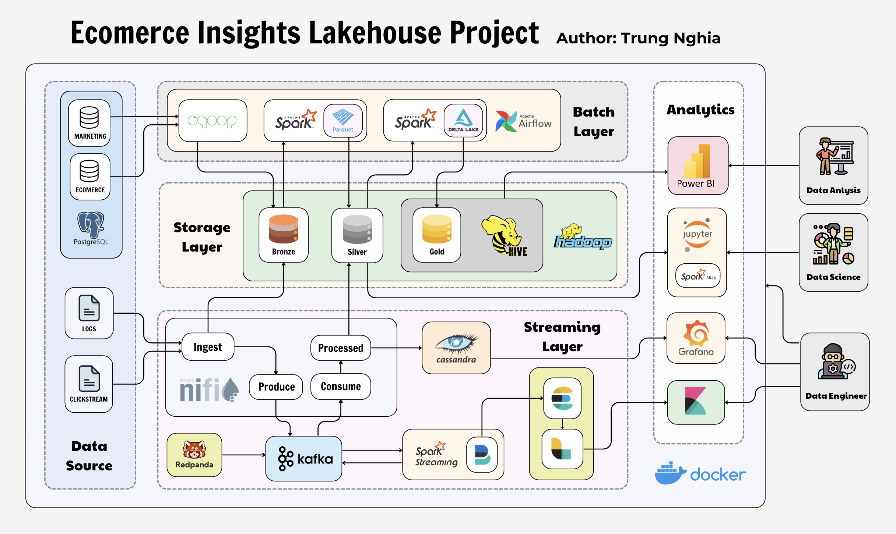
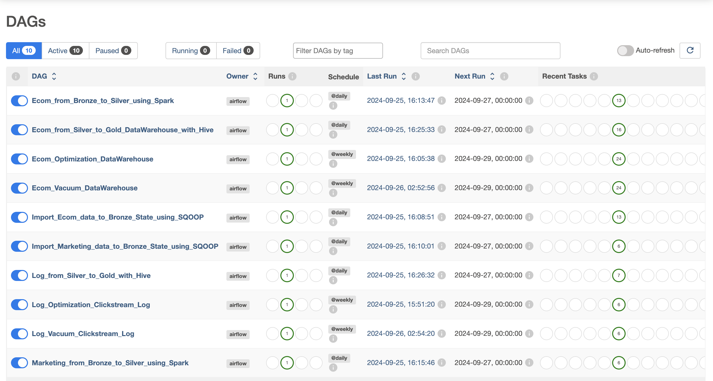
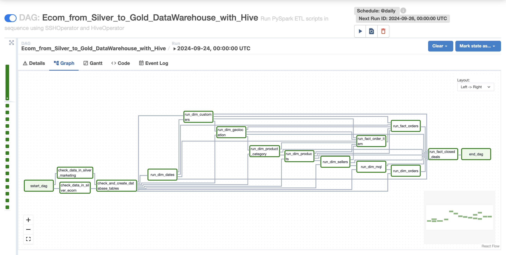
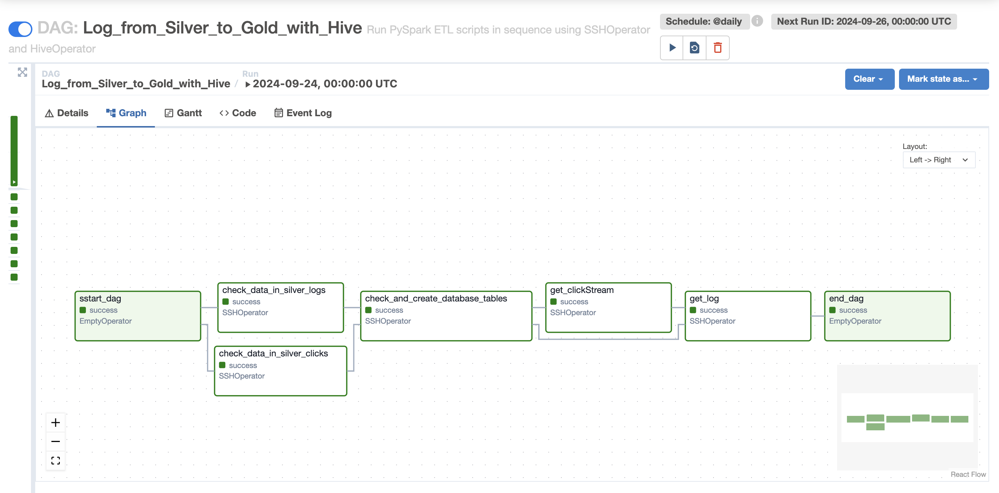

# BIG DATA PROJECT: Ecomerce Insights Lakehouse Project
<span style="color:red">**WARNING:** This project only runs on ARM64 chips.</span>

# Table of Contents

1. **[Project Objective](#project-objective)**
2. **[Datasets Selection](#datasets-selection)**
3. **[System Architecture](#system-architecture)**
   - [Data Sources](#data-sources)
   - [Data Processing Layers](#data-processing-layers)
   - [Storage Layer](#storage-layer)
   - [Analytics and Reporting](#analytics-and-reporting)
4. **[Technologies Used](#technologies-used)**
5. **[Deployment](#deployment)**
   - [System Requirements](#system-requirements)
   - [Running the Project](#running-the-project)
   - [Monitoring](#monitoring)
6. **[Results](#results)**
8. **[Future Work](#future-work)**
9. **[Authors](#authors)**

# Project Objective
The goal of **Ecomerce Insights Lakehouse Project** is to design and build an end-to-end **E-Commerce Data Lakehouse** that integrates various data sources from `PostgreSQL` databases (Ecom and Marketing) and log-based data (ecommerce_clickstream_transactions and access_log_ecommerce). This architecture combines batch and real-time data processing to provide insights for data analytics, data science, and business intelligence using tools like `Power BI` and `Jupyter Notebook`. The system also monitors the data pipelines and streaming jobs using `Grafana`, `Kibana`, and other monitoring tools.

# Datasets Selection

## 1. Brazilian E-Commerce Public Dataset by Olist and Marketing Funnel by Olist

### 1.1. Brazilian E-Commerce Public Dataset by Olist
- Source: [Brazilian E-Commerce Public Dataset by Olist](https://www.kaggle.com/datasets/olistbr/brazilian-ecommerce)

This dataset was generously provided by **Olist**, the largest warehouse in the **Brazilian markets**. Olist connects small businesses across Brazil to channels seamlessly and with a single contract. These merchants can sell their products through Olist Store and ship them directly to customers using Olist's logistics partners.

### 1.2. Marketing Funnel by Olist
- Source: [Marketing Funnel by Olist](https://www.kaggle.com/datasets/olistbr/marketing-funnel-olist)

This is a marketing funnel dataset from sellers that filled-in requests of contact to sell their products on Olist Store. The dataset has information of 8k Marketing Qualified Leads (MQLs) that requested contact between *Jun. 1st 2017* and *Jun 1st 2018*. They were randomly sampled from the total of MQLs.

### 1.3 Join two Dataset and import to PostgresDB

Both the **Brazilian E-Commerce Public Dataset** and the **Marketing Funnel by Olist** were imported into a `PostgreSQL` database to form the foundation of the project's data warehouse. The resulting schema integrates customer transactions with lead generation efforts, providing a holistic view of e-commerce operations and marketing strategies.

  <center>
      
  </center>

## 2. Ecommerce Clickstream Transactions
- Source: [Ecommerce Clickstream Transactions](https://www.kaggle.com/datasets/ren294/ecommerce-clickstream-transactions)
  
This dataset provides simulated data for user interactions on an e-commerce platform. It includes sequences of events such as page views, clicks, product views, and purchases. Each record captures user activity within sessions, making it suitable for analyzing clickstream paths and transaction sequences.

## 3. Access Log E-Commerce
- Source: [Access Log E-Commerce](https://www.kaggle.com/datasets/ren294/access-log-ecommerce)
  
The **Access Log E-Commerce** dataset simulates server logs that detail user interactions with the e-commerce platform at the backend. Each log entry provides metadata such as timestamp, IP address, request type, status codes, and other parameters commonly found in server access logs.

# System Architecture

The **Data Lakehouse** architecture implemented in this project is meticulously designed to accommodate both batch and real-time streaming data, seamlessly integrating multiple data sources into a cohesive analytics platform. This architecture follows the `Medallion Architecture` pattern, which organizes data into **Bronze**, **Silver**, and **Gold layers**, each serving specific roles in the data lifecycle. 

## System Overview

The system is divided into several components, each responsible for specific tasks within the data process:

  <center>
      
  </center>

## Data Sources

The architecture brings together structured and unstructured data from several key sources:

### 1. PostgreSQL Databases:

- **Ecom Database**: Contains structured data related to customer information, orders, product details, reviews, sellers, and transactions. This database reflects the transactional core of the e-commerce platform.

- **Marketing Database**: Contains marketing-related data, particularly focused on Marketing Qualified Leads (MQLs), helping to track the effectiveness of marketing efforts and the progression of leads through the funnel.

### 2. Log-Based Data:

- **Ecommerce Clickstream Transactions**: This dataset captures user interactions with the e-commerce platform, such as clicks, views, and purchases. It reflects customer behavior in real-time, making it essential for analyzing user engagement and optimizing the shopping experience.

- **Access Log E-Commerce**: Server logs that provide metadata about user activity, requests, and system performance. This log-based data is critical for tracking the health and uptime of the platform.

## Data Processing Layers
The system processes data in distinct layers, each serving a different purpose in the overall workflow.

### 1. Batch Layer

- **Ingestion**: Structured data from `PostgreSQL` databases (Ecom and Marketing) is ingested into the **Bronze layer** of the *Data Lakehouse* using `Sqoop`, scheduled through `Apache Airflow` for regular updates. This ensures that fresh data is continuously available for processing.

- **Transformation**: Once ingested into the **Bronze layer**, the data is processed by `Apache Spark` to clean, enrich, and transform it into more structured formats. This refined data is then stored in the **Silver layer** of the *Data Lakehouse*.

- **Storage**: The transformed data is stored in `HDFS` in the **Silver layer** as `Parquet` files, providing an efficient storage format for analytics. The data is then further processed and written to the **Gold layer**, which utilizes `Delta Lake` and `Hive` for highly structured, query-optimized data. This layer is designed for high performance in analytical queries and is the final stage of batch processing.

### 2. Streaming Layer
- **Real-Time Ingestion**: Streaming data from *ecommerce_clickstream_transactions* and *access_log_ecommerce* is ingested into the system using `Apache NiFi` and published to `Kafka` topics.

- **Real-Time Processing**: `Apache Spark Streaming` consumes the Kafka topics and processes the data in near real-time, cleaning and enriching it before publishing it to new `Kafka` topics. These processed streams are then ingested by `NiFi` and stored in `Cassandra` for quick retrieval and further analysis.

- **Monitoring**: Processed real-time data is stored in `Cassandra` and `HDFS Silver` for quick retrieval and analysis. Logs from `Spark Streaming` jobs are monitored using `Filebeat` and `Logstash`, with logs being sent to `Elasticsearch` for detailed log analysis and visualizations through `Kibana`. `Redpanda`’s built-in monitoring tools help track Kafka topic health, consumer lag, message throughput, and latency, ensuring that the streaming layer remains performant and reliable.

## Storage Layer
The storage layer follows a **Bronze-Silver-Gold** tiered model, where data transitions from raw to refined as it moves through the pipeline:

- **Bronze Layer**: Raw, unprocessed data from various sources, such as `PostgreSQL` and log files, is stored in `HDFS`. This is the initial ingestion layer, where data is kept in its original form.

- **Silver Layer**: Here, processed and cleaned data is stored as `Parquet` files in `HDFS`. This layer is tailored for analytics and machine learning, providing a refined dataset for querying and model building.

- **Gold Layer**: The Gold layer features highly optimized and structured data, utilizing `Delta Lake` and `Hive`. This layer is designed for high performance and efficient querying, making it ideal for reporting and business intelligence tools such as `Power BI`.


## Analytics and Reporting

- **Data Science**: `Spark MLlib` is used in conjunction with Jupyter Notebook for advanced analytics and machine learning. Data scientists can access data from the Silver layer to build predictive models, analyze customer behavior, and generate insights into product recommendations, churn predictions, and more.

- **Business Intelligence**: `Power BI` is employed to visualize data from the **Gold layer**. Business users can create dynamic dashboards and reports, providing insights into sales performance, customer segmentation, marketing effectiveness, and operational metrics.

## Monitoring and Logging
A comprehensive monitoring and logging system is integrated into the architecture to ensure the smooth operation of data pipelines and processing jobs.

- **Grafana**: Monitors system metrics such as CPU, memory, and disk usage of the Docker containers hosting various components.
  
- **Elastic Stack (Filebeat, Logstash, Kibana)**: Logs from `Spark` jobs are collected using `Filebeat`, passed through `Logstash` for processing, and indexed into `Elasticsearch`. `Kibana` is used to visualize these logs, providing insights into job performance, system errors, and resource utilization.
  
- **Docker**: The entire architecture is containerized using Docker for easy deployment and scaling. Monitoring of the `Docker containers` is managed, which tracks CPU, memory, and resource usage for each container.
  
- **Apache Airflow UI** is used for scheduling and monitoring batch jobs. The `Airflow UI` allows visualization of `DAGs` (Directed Acyclic Graphs), tracking job statuses, scheduling intervals, and monitoring task failures or successes.

# Data Warehouse Architecture in the Gold Layer

The **Gold Layer** in a data lakehouse architecture represents the final, refined stage where clean, processed, and analytics-ready data is stored. This layer is specifically designed for consumption by business intelligence tools, data scientists, and analysts. In the context of an eCommerce Data Warehouse, the **Gold Layer** is where critical business metrics, aggregated datasets, and key insights are stored in an optimized format.

The schema DataWarehouse:

  <center>
      
  </center>

# Technologies Used
The *Data Lakehouse* architecture implemented in this project leverages a range of modern technologies to efficiently manage, process, and analyze data from various sources. The following sections provide a detailed overview of the technologies used in each aspect of the system, including data ingestion, processing, storage, analytics, and monitoring.

## Data Ingestion and Integration
  
- **Apache NiFi**: `NiFi` supports real-time data streaming, flexible routing, data transformation, and error handling.
  
- **Apache Sqoop**: `Sqoop` enables scheduled imports and exports, integration with Hadoop ecosystems, and efficient bulk data transfer.
  
- **Apache Kafka**: `Kafka` provides scalability, fault tolerance, and high-throughput message processing for real-time data ingestion.
  
- **Redpanda**: `Redpanda` provides real-time insights into `Kafka` pipelines, reducing operational overhead while ensuring high availability and fault tolerance.

## Data Processing

- **Apache Spark**: For both real-time and batch data processing.
  
- **Spark MLlib**: `MLlib` integrates seamlessly with `Spark`, allowing data scientists to work with large datasets and build scalable machine learning models within the same ecosystem.

## Data Storage

- **Hadoop Distributed File System (HDFS)**: `HDFS` offers distributed storage, fault tolerance, and scalability for managing large volumes of data.
  
- **Apache Hive**: `Hive` provides data warehousing capabilities, schema-on-read, and efficient querying through the use of optimized storage formats like `Parquet`.

- **Delta Lake**: `Delta Lake` brings ACID transaction capabilities and schema enforcement to data lakes, enabling reliable data management and simplifying the process of building a data pipeline.
  
- **Apache Cassandra**: `Cassandra` offers high throughput for real-time data storage, horizontal scalability, and fault tolerance.

## Data Analytics and Visualization

- **Power BI**: `Power BI` offers interactive dashboards, real-time data visualization, and easy integration with `Hive` , `Delta Lake`, and other databases for querying large datasets.
  
- **Jupyter Notebooks**: `Jupyter` provides an interactive environment for exploring data, building models, and visualizing results, integrating seamlessly with `Spark` and `MLlib`.

## Orchestration and Scheduling

- **Apache Airflow**: `Airflow` supports complex workflows, real-time monitoring via the `Airflow UI`, automatic retries, and alerting for failed tasks.
  
- **Airflow UI for Monitoring**: The `Airflow UI` provides a graphical interface for monitoring DAGs and tasks, displaying their statuses, success/failure rates, and execution times.

## Monitoring and Logging

- **Elasticsearch and Kibana**: `Elasticsearch` offers high-speed search capabilities, while `Kibana` provides advanced visualizations and dashboards to track log patterns and job performance.
  
- **Filebeat and Logstash**: `Filebeat` is lightweight and efficient for log collection, while Logstash enables complex log transformations and filtering, making it easier to diagnose issues.
  
- **Redpanda Monitoring**: `Redpanda`’s lightweight design offers enhanced Kafka monitoring with simplified operational complexity, making it a preferred choice for streaming workloads.
  
- **Grafana**: `Grafana` integrates directly with `Cassandra`, enabling users to query and visualize data. This allows for effective real-time monitoring and data analysis from the `Cassandra` data store.

# Deployment

## System Requirements

To deploy and run this *Data Lakehouse* project, the following system requirements are necessary:

### Hardware

- **Processor**: `ARM64` chip with at least 12 CPU cores.
  
- **Memory**: 32 GB of RAM.
  
- **Storage**: 50 GB of free storage space.
  
### Software

- **Operating System**: A `Linux-based` OS supporting `ARM64` architecture.
  
- **Docker**: Pre-installed to run all components in isolated containers.
  
- **Docker Compose**: Pre-installed for orchestrating multi-container Docker applications.
  
- **Power BI**: Installed on the *host machine* or on a *Windows virtual machine* for data visualization.

## Running the Project

### 1. Clone the Project Repository

**1.1. Install Git (if not already installed)**

- Install `Git` to clone the repository:

    ```bash
    sudo yum install -y git
    ```
    
**1.2. Clone the Repository**

- Run the following command to clone the project repository:

    ```bash
    git clone https://github.com/Ren294/ECommerce-Insights-LakeHouse.git
    ```

- Navigate to the project directory:

  ```bash
  cd ECommerce-Insights-LakeHouse
  ```

### 2. Running the Project

**2.1. Grant Execution Permissions for Shell Scripts**

- Once connected, ensure all shell scripts have the correct execution permissions:

  ```bash
  chmod +x ./*
  ```

  - This command grants execute permissions to all .sh files in the project directory, allowing them to be run without any issues.

**2.2. Initialize the Project Environment**

- Run the `init.sh` script to initialize the environment:

    ```bash
    ./init.sh
    ```
    
- This script performs the following tasks:
  - Sets the `AIRFLOW_UID` environment variable to match the current user's ID.
  - Prepares the environment for running `Airflow` by initializing it with `Docker`.
  - Download data from `Kaggle`

**2.3. Start the Docker Containers**

- Next, bring up all the services defined in the `docker-compose` file:

    ```bash
    docker-compose --profile all up
    ```
    
   - This command starts all the necessary containers for the project

**2.4. Post-Deployment Configuration**

- After the `Docker containers` are running, execute the `after-compose.sh` script to perform additional setup:

    ```bash
    ./after-compose.sh
    ```
    
- This script:
  - Sets up `HDFS directories` and assigns the appropriate permissions.
  - Sets up databases for `Postgres`, `Cassandra`

**2.5. Configure and Run Apache NiFi**
To kick off your data processing workflows, follow these steps to configure and run Apache NiFi:
- Open the `NiFi Web UI` by navigating to `http://localhost:8443/nifi` in your browser.

- Add the [template](template/ECOM_Template.xml) for the `NiFi` workflow:

    <center>
        
    </center>

- You will now see several key components in your NiFi workflow:

  - `LogToBronzeState`: This processor handles the ingestion of e-commerce logs into the Bronze layer for initial processing.
  
    <center>
        
    </center>  

  - `ClickToBronzeState`: This flow is responsible for ingesting clickstream data into the **Bronze stage**, preparing it for further analysis.  

    <center>
        
    </center> 

  - `ToSilverState`: Once the raw data is in the Bronze layer, this process takes over to clean, transform, and load the data into the **Silver layer**.

    <center>
        
    </center>

  - `Ecom_log`: This processor manages the ingestion of server logs from your e-commerce platform, ensuring structured log data is efficiently routed. 

    <center>
        
    </center>   

  - `Ecom_clickstream`: This final component collects clickstream data from user interactions on the e-commerce site and processes it for analytical use.  

    <center>
        
    </center>

**2.6. Run Apache Spark**

Once the infrastructure is set up and data is flowing through the system, you can trigger your `Apache Spark Streaming` jobs to process real-time data. These jobs will handle the incoming streams from the clickstream and access logs, transforming and processing them for further stages.

- Run the `Clickstream Streaming Job`:

  ```
  docker exec -it spark-master bash -f /opt/spark-apps/streaming/clickStreaming.sh
  ```
  
  - This will start the **Clickstream streaming job**, continuously ingesting and processing real-time data as it arrives.
  
- Run the `Log Streaming Job`:

  ```
  docker exec -it spark-master bash -f /opt/spark-apps/streaming/logStreaming.sh
  ```
  
  - This will initiate the log streaming job, transforming raw logs into structured data that can be further processed and stored.

**2.7. Run Apache Airflow DAGs**

- Open the `Airflow Web UI` by navigating to `http://localhost:6060` in your browser

- Login with

  - **Username**: *ren294*
  - **Password**: *ren294*

- After login, it's time to activate the **DAGs (Directed Acyclic Graphs)** that control the data workflows. The project consists of six pre-configured `DAGs`, which you can activate from the `Airflow` dashboard:
  
    <center>
        
    </center>

Here are the six DAGs and their respective functions:  

  - **`Import_Ecom_data_to_Bronze_State_using_SQOOP`**: This **DAG** facilitates the extraction of e-commerce data from PostgreSQL and ingests it into the **Bronze layer** via `Sqoop`.

    <center>
        
    </center> 

  - **`Import_Marketing_data_to_Bronze_State_using_SQOOP`**: Similar to the e-commerce import, this **DAG** ingests marketing data from `PostgreSQL` into the **Bronze layer** for further processing.

    <center>
        
    </center> 

  - **Ecom_from_Bronze_to_Silver_using_Spark**: Once the e-commerce data is ingested into the **Bronze layer**, this DAG is responsible for transforming the raw data and moving it into the **Silver layer** using `Spark`.

    <center>
        
    </center> 

  - **Marketing_from_Bronze_to_Silver_using_Spark**: This DAG performs similar transformations for the marketing data, moving it from the **Bronze** to the **Silver layer**.

    <center>
        
    </center> 

  - **Ecom_from_Silver_to_Gold_DataWarehouse_with_Hive**: This DAG completes the final step in the e-commerce data pipeline, transferring clean data from the **Silver layer** into the **Gold data warehouse** using `Hive` and `Parquet` format.

    <center>
        
    </center> 

  - **Log_from_Silver_to_Gold_with_Hive**: This DAG is responsible for processing and transforming log data from the **Silver layer** to the **Gold data warehouse** using `Hive` for structured storage in `Parquet` format.
  
    <center>
        
    </center> 

### 3. Visualization for PowerBI

To visualize and analyze your processed data, follow these detailed steps to set up `Power BI` and connect it to your `Hive` data warehouse:

**3.1. Start Power BI**
  
- **Open Power BI Desktop**: Launch `Power BI Desktop` on your `Windows` machine or virtual environment. Ensure that you have `Power BI` installed and properly configured to connect to your data sources.

- **Initialize Your Workspace**: Once `Power BI Desktop` is open, you will be greeted with the main interface where you can start creating reports and dashboards. Make sure you have a clear workspace to begin importing and analyzing your data.

**3.2. Get data from Hive**

- Select `Spark` and connect:
  
  ```
  Server: http://<id>:10004/cliservice
  Protocol: HTTP
  Data Connectivity mode: DirectQuery
  ```
  
  - Replace `id` with the appropriate identifier for your `Hive server`. This configuration allows `Power BI` to connect directly to the `Hive server` using `Spark’s Thrift Server`.

    <center>
        
    </center>

- Click `OK` to establish the connection. Once connected, `Power BI` will prompt you to select the data tables or views you want to load. Choose the relevant tables or datasets that you want to visualize.

**3.3. Import the Power BI Template (.pbit):**
- Click on `File` in the `Power BI` ribbon.

- Select `Import` from the drop-down menu.

- Choose `Power BI Template`.

- Browse to the [location](powerbi) of the provided `.pbit` file, which contains the predefined visualizations for your project.

**3.4. Explore the Three Pre-configured Pages:**

- **Warehouse Page**: This page displays metrics related to your data warehouse, including product sales, order status distributions, and financial summaries like total revenue and freight costs. 

    <center>
        
    </center>

- **Log Page**: This page focuses on server access logs and system performance, providing insights into website traffic, error rates, and server activity.

     <center>
        
    </center>

- **ClickStream Page**: On this page, you’ll find detailed analytics on user behavior from the clickstream data.

    <center>
        
    </center> 

### 4. Access and Analyze Data with Jupyter Notebook

For more advanced data analysis and machine learning tasks, you can use `Jupyter Notebook`, which provides an interactive environment for working with your eCommerce data. Here's how to set up and access `Jupyter Notebook` within the `Docker` environment:

**4.1. Run get-token.sh to Retrieve Access Token:**
- First, you need to retrieve the `Jupyter` access token by running the following script inside the `Docker container`:

  ```
  ./get-token.sh
  ```
  
  - This script will print a URL containing the token that you’ll need to log in to `Jupyter Notebook`.

**4.2. Open Port 9999:**
- You can access `Jupyter Notebook` by navigating to:

  ```
  http://localhost:9999
  ```

- Paste the token generated by `get-token.sh` when prompted.

    <center>
        
    </center>

**4.3. Open the Preconfigured Notebook:**
- After logging into `Jupyter Notebook`, navigate to the `work/analysis.ipynb` file. 

    <center>
        
    </center>

**4.4. Create a New Notebook (Optional):**
- If you want to create a new analysis file, click on `New` in the `Jupyter dashboard`, and select `Python 3` to start a new notebook.
  
- Save your new notebook in the `work/` directory to maintain consistency with the project structure:

  ```
  work/new_analysis.ipynb
  ```

### 5. Access and Visualize Data with Grafana

`Grafana` is used in this project to visualize the data stored in `Cassandra`. Follow these steps to access `Grafana`, connect it to `Cassandra`, and either use a pre-built dashboard or create your own custom visualizations:

**5.1. Open Grafana by Accessing Port 3000:**

- Ensure that port 3000 is exposed in your `Docker` setup, which is used for `Grafana`.

- Navigate to the following URL in your browser to access `Grafana`:

  ```
  http://localhost:3000
  ```

**5.2. Log in to Grafana:**

- Use the default credentials:
  
  - **Username**: *admin*

  - **Password**: *admin*

- After logging in for the first time, you may be prompted to change the password. You can either update it or continue with the default password.

**5.3. Create a New Data Source Connection with Cassandra::**

- In `Grafana`’s main menu, click on `Configuration` and then `Data Sources`.

- Click `Add data source` and search for `Cassandra`.

- Configure the connection with your `Cassandra database`:

  - **Host**: *cassandra1:9042,cassandra1:9042*
  - **Port**: 9042
  - **Keyspace**: log_data

      <center>
          
      </center>

- Save and test the connection to ensure that `Grafana` can access `Cassandra`.

**5.4. Import a Pre-built Dashboard:**

- To quickly visualize your data, import a pre-built dashboard that has been specifically designed for this project:

  - In the left sidebar, click `Dashboard` and then `Manage`.
  
  - Click on `Import` and upload the [template file](grafanaTemplate), which contains predefined charts and metrics for monitoring Cassandra data.

- The following dashboards will be available:

  - **ClickStreamEcom Dashboard**: This dashboard visualizes user interactions with the eCommerce platform, including page views, product clicks, and purchase patterns.

      <center>
          
      </center>
  
  - **LogEcom Dashboard**: This dashboard provides insights into server logs, helping you monitor system performance and user access patterns.

      <center>
          
      </center>

**5.5. Create Your Own Custom Dashboard (Optional):**

- If you prefer to build your own dashboard, follow these steps:

  - Click on `Dashboard` → `New Dashboard`.
  
  - Select `Add New Panel` and choose the type of chart (e.g., bar chart, time series, pie chart) that you want to create.
  
  - Configure the panel by selecting `Cassandra` as the data source, and write CQL queries to pull the data you want to visualize.
  
  - Customize your panels with labels, filters, and other options, then save the dashboard.

### 6. Visualization with Kibana

- `Kibana` is used in this project for visualizing data ingested into `Elasticsearch`, such as server logs and application metrics from the eCommerce platform.

**6.1. Steps to Access Kibana**:

- Open Kibana on Port 5601: [http://localhost:5601](http://localhost:5601)

- Kibana Interface: Once Kibana is opened, you’ll see the Kibana interface, which provides various tools for visualizing and exploring your data.

**6.1. Create Index Pattern in Kibana:**

- Set up Index Patterns:
  
  - In the `Kibana` interface, click on `Management` from the left sidebar.
    
  - Under `Kibana`, click `Index Patterns`.
    
  - Click `Create index pattern` to define how `Kibana` recognizes your `Elasticsearch` indices.
    
  - Enter the name of your index.
    
  - Choose a `Time Field` (for example, @timestamp) that `Kibana` will use for time-based visualizations.
    
  - Click Create `Index Pattern`.

      <center>
          
      </center>

**6.2. Create a Dashboard in Kibana:**

- Create `Visualizations`:

  - From the left-hand menu, click `Visualize`.
    
  - Click `Create New Visualization` and choose the type of chart (e.g., bar chart, pie chart, line graph, etc.).
    
  - Select your `index pattern` (e.g., log-ecommerce-*), and write queries or apply filters to visualize the data you are interested in (e.g., logs filtered by status codes, user access by city, etc.).
    
  -  You can use the `Discover tab` to explore your data and understand what fields are available for visualizations.

      <center>
          
      </center>

## Monitoring

In a complex data lakehouse architecture, monitoring the system components is essential for ensuring smooth operation and quickly identifying and resolving issues. The following are key tools used to monitor different components in this setup:

### 1. Monitoring Batch Jobs with Airflow Web UI

`Airflow` is used to schedule and manage batch jobs that execute the **ETL (Extract, Transform, Load)** pipelines. The `Airflow Web UI` provides a centralized interface for monitoring the execution of these jobs.

- **DAG Overview**: You will see a list of **Directed Acyclic Graphs (DAGs)**, representing the batch jobs. Each DAG shows the last execution status: success, failure, or pending.

    <center>
        
    </center>

- **Task Monitoring**: Click on a DAG to view the individual tasks within that workflow. You can check:
  - **Task status**: Green for success, red for failure, yellow for in progress.
  - **Task duration**: Helps in identifying bottlenecks.
  - **Logs**: For each task, detailed logs are available for debugging.
 
    <center>
        
    </center> 

### 2. Monitoring Kafka with Redpanda Console

`Kafka` is used for handling real-time data streaming, and `Redpanda` Console offers a robust monitoring interface to observe `Kafka`’s performance.

- **Access Redpanda Console**: Use the `Redpanda UI` to monitor `Kafka`. `Redpanda Console` provides visibility into Kafka topics, partitions, producers, consumers, and their latencies.

    <center>
        
    </center> 

- **Key Metrics**:

  - **Consumer Lag**: Check for any delays in data processing by consumers.

  - **Topic Monitoring**: Ensure data is flowing into the correct topics.

  - **Broker Health**: Monitor Kafka brokers to ensure they are running without performance issues.
  
    <center>
        
    </center>
    
- **Topic Management**: You can create, delete, or configure Kafka topics directly from the console.

### 3. Monitoring Data Flow Processors with NiFi Web UI

Apache NiFi manages the flow of data through various sources and sinks in real-time. The `NiFi Web UI` provides an intuitive interface to monitor and manage data flows.

- **Open NiFi Web UI**: Navigate to http://localhost:8443/nifi to access the NiFi dashboard (introduced in [Configure and Run Apache NiFi](#Configure-and-Run-Apache-NiFi)).
  
- **Processor Status**: View each processor's status to see if it’s running, stopped, or encountering errors.
  
- **Data Provenance**: This feature allows you to trace the lifecycle of any data passing through the NiFi flow. It’s useful for debugging data anomalies.
  
- **Back Pressure**: Monitor back pressure on queues to ensure data is being processed without delay. If back pressure is high, `NiFi` might need tuning or resource adjustments.

### 4. Monitoring Spark Streaming with Kibana

`Spark Streaming` processes real-time data and logs can be visualized and monitored using `Kibana`, a part of the **ELK Stack** (`Elasticsearch`, `Logstash`, `Kibana`).

- **Access Kibana**: Open the `Kibana` dashboard by navigating to http://localhost:5601 (introduced in [Configure and Visualization with Kibana](#Visualization-with-Kibana)).
  
- **Create Index Pattern**: Create an index pattern to pull data from `Elasticsearch`, where `Spark` logs are stored.
  
- **Dashboards**: Use pre-built or custom dashboards to monitor `Spark Streaming` job status. Look for:
  
  - **Job execution time**s: To identify slow tasks or jobs.
    
  - **Error logs**: Filter logs to find any failures or errors in `Spark` jobs.
    
  - **Log Search**: Use `Kibana`’s search functionality to filter logs by time, job ID, or error type, helping to diagnose issues.

### 5. Monitoring Docker Containers with Docker Desktop

- All components (`Airflow`, `Kafka`, `NiFi`, `Spark`, `Cassandra`, etc.) are running in `Docker` containers. Docker Desktop provides a central platform to monitor the health and performance of all containers.
  
  - **Open Docker Desktop**: You can monitor the status of each container running in the environment from `Docker Desktop`.
    
  - **Container Health**: Check if any container is unhealthy, stopped, or restarting frequently. Each container’s resource usage (CPU, memory, and network I/O) can also be monitored.
    
  - **Logs**: Access real-time logs of any container to diagnose errors or failures. Logs can also be streamed to external monitoring systems like `ELK` for deeper analysis.
    
  - **Resource Management**: `Docker Desktop` provides an overview of how much CPU, RAM, and disk space each container is using. This helps in managing system resources efficiently.
 
    <center>
        
    </center>

# Results

## 1. Visualization with PowerBI

- **PowerBI for DataWarehouse Ecom**: This dashboard provides an overview of e-commerce data, including key metrics and performance indicators. It visualizes data from the Data Warehouse, highlighting trends and insights into sales and customer behavior.

    <center>
        
    </center>

- **PowerBI for Log Ecom**: This `Power BI` report focuses on log data, offering detailed visualizations of web access patterns and system performance. It helps in understanding user interactions and identifying potential issues in the e-commerce system.

    <center>
        
    </center>

- **PowerBI for ClickStream Ecom**: This visualization captures user clickstream data, providing insights into customer navigation patterns and click behavior on the e-commerce platform.

    <center>
        
    </center>

## 2. Analysis with Jupyter (some Examples):

- **Numbers of Orders per day**: This analysis displays the daily order volume, offering a clear view of sales trends and patterns over time.

    <center>
        
    </center>

- **Numbers of Orders by Day of Orders by Day of the Week and Hour of the Day**: This visualization breaks down orders by day of the week and hour of the day, revealing peak times and trends in customer purchasing behavior.
 
    <center>
        
    </center>

- **Top 10 cities by number of orders**: This analysis highlights the top 10 cities with the highest order volumes, providing insights into regional sales performance.

    <center>
        
    </center>

- **Sales by Category**: This visualization shows sales distribution across different product categories, helping identify popular and underperforming categories.

    <center>
        
    </center>

## 3. Monitoring with Grafana:

- **Monitoring Web Acess with Grafana**: `Grafana` provides a comprehensive view of web access logs, visualizing access patterns and helping monitor the performance and availability of the e-commerce site.

    <center>
        
    </center>

- **Monitoring ClickStream with Grafana**: This `Grafana` dashboard visualizes clickstream data, tracking user interactions and navigation paths on the e-commerce platform.

    <center>
        
    </center>

## 4. Monitoring Spark Streaming Job with Kibana:

- **Monitoring Spark Job by Visualization**: `Kibana` visualizes `Spark` job metrics and performance, providing insights into job execution and resource utilization.

    <center>
        
    </center>

- **Monitoring Spark Job by individual log**: This `Kibana` view shows detailed logs for individual Spark jobs, assisting in troubleshooting and performance analysis.

    <center>
        
    </center>

## 5. Monitoring Spark Job with Airflow Web UI:

- **Monitoring Spark Job by Airflow Task**: `Airflow Web UI` offers detailed monitoring of `Spark` job tasks, including DAG execution, task statuses, and performance metrics.
  
    <center>
        
    </center>

    <center>
        
    </center>

    <center>
        
    </center>

    <center>
        
    </center>

## 6. Monitoring Container with Docker Deskstop:

- **Docker Container Monitoring**: `Docker Desktop` provides visualization and management capabilities for all `Docker` containers, helping monitor container performance and resource usage.

    <center>
        
    </center>

# Future Work
## 1. Enhanced Real-Time Analytics

- **Improved Stream Processing**: Implement advanced real-time analytics and anomaly detection using machine learning models within Spark Streaming.

- **Edge Computing**: Explore edge computing solutions to process data closer to the source, reducing latency and improving response times.

## 2. Advanced Data Integration

- **Additional Data Sources**: Integrate more data sources such as social media and third-party APIs to enrich the data lakehouse with diverse datasets.

- **Unified Data Model**: Develop a unified data model that seamlessly integrates disparate data sources for more comprehensive analysis.

## 3. Scalability and Performance Optimization

- **Cluster Expansion**: Scale the Kafka, Spark, and NiFi clusters to handle increased data volumes and processing loads more efficiently.

- **Resource Optimization**: Optimize resource allocation and utilization to improve performance and reduce costs, particularly for cloud-based deployments.

## 4. Enhanced Data Visualization

- **Interactive Dashboards**: Develop more interactive and dynamic dashboards in Power BI, Grafana, and Kibana for deeper insights and user engagement.

- **Custom Alerts and Notifications**: Implement custom alerts and notifications in Grafana and Kibana to proactively monitor system health and performance metrics.

## 5. Security and Compliance

- **Data Encryption**: Enhance security by implementing data encryption at rest and in transit across the data pipeline.

- **Compliance Monitoring**: Introduce features to ensure compliance with data protection regulations such as GDPR and CCPA.

## 6. Automation and Orchestration

- **Automated Data Quality Checks**: Implement automated data quality checks and validation processes to ensure data accuracy and integrity.

- **Expanded Airflow DAGs**: Develop additional Airflow DAGs to automate new data workflows and integrate with additional tools and services.

## 7. User Experience Enhancements

- **User Training**: Provide training and documentation to end-users for effectively utilizing the new dashboards and analytical tools.

- **Feedback Mechanism**: Establish a feedback mechanism to gather user input for continuous improvement of the system.

# Authors
Nguyen Trung Nghia
- Contact: trungnghia294@gmail.com
- GitHub: [Ren294](https://github.com/Ren294)
- Linkedln: [tnghia294](https://www.linkedin.com/in/tnghia294/)

